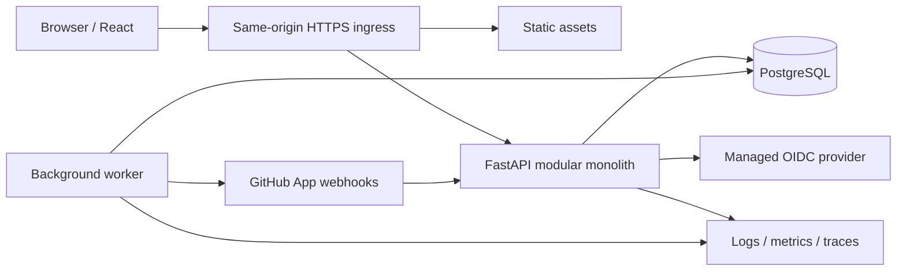

# Architecture

Status: accepted direction for implementation following the user's instruction on 2026-09-25. Detailed operating targets remain planning assumptions.

## Evidence and scope

The inspected checkout contains a synthetic customer-churn portfolio application (root README, `backend/app/main.py`, `database/schema.sql`, `frontend/package.json`). Its single customer snapshot table, eleven read-only API routes, ML pipeline, and analytics screens are unrelated to DevHub. No DevHub requirements existed in tracked files. The user subsequently confirmed organizations, projects, tasks, discussions, and GitHub integration, then authorized a fresh implementation.

DevHub lives in its own `devhub/` subtree with independent dependencies, database, migrations, tests, and deployment context. Existing churn files are preserved. A future move to a separate repository is a directory move, not a data migration.

## System design

The backend is a modular monolith with identity, organization policy, project collaboration, and GitHub integration boundaries. Modules share one transactional database and deployment artifact; a worker runs separately. Modules call explicit policy and service functions rather than HTTP calls to each other. HTTP handlers validate transport data; domain policy checks authorize both resources and changed fields before persistence.

The React SPA uses the same origin for `/api/v1` and `/auth`. The backend holds OIDC credentials; the browser gets an opaque cookie and a CSRF token. Public SEO and server-side rendering are not current requirements. Frontend permissions improve usability; only backend decisions enforce access.

## Major decisions

| Decision | Reason and tradeoff | Revisit trigger |
| --- | --- | --- |
| FastAPI + React/TypeScript | Familiar, separately testable API and client; no churn logic reused | Team skill or a verified SSR requirement changes |
| Modular monolith | Keeps membership checks and writes transactional; avoids distributed permissions and operational overhead | Independently scaling or owning a module becomes demonstrably necessary |
| PostgreSQL + SQLAlchemy + Alembic | Referential integrity, concurrency, migrations, row security; SQLite is not the production database | Demonstrated workload requiring another store |
| Shared schema, `org_id` tenant keys | Efficient small-tenant operation; requires rigorous isolation tests | Contractual isolation/residency requires dedicated tenant databases |
| Application RBAC plus tenant RLS | Resource policies handle private projects; database reduces accidental cross-tenant reads | External policy engine justified by policy complexity |
| Managed OIDC + server-side sessions | Provider handles passwords/MFA; local revocation is immediate for new requests | Native/mobile or external API clients become required |
| Transactional outbox + leased worker | A committed mutation also commits its event; retries may duplicate delivery and must be idempotent | Queue contention or traffic warrants a managed broker |
| GitHub App, read-only metadata | Installation permissions are scoped; no personal access token storage or code execution | Explicit requirement for repository writes or source ingestion |
| No cache dependency initially | Correctness and revocation remain simple | Measured database bottleneck with a safe invalidation design |

## Module ownership

Identity owns users, provider identities, sessions, and OIDC login attempts. Organizations own membership, invitations, roles, and audit entries. Collaboration owns projects, project grants, tasks, discussions, and comments. Integration owns installations, repository mappings, delivery receipts, and synchronization. No client can set `org_id`, creator, role, or foreign resource fields without server validation.

Project content is strongly consistent. GitHub metadata and notifications are eventually consistent and expose freshness/error states. PostgreSQL is authoritative; provider outages do not prevent local project work. A worker retries with bounded exponential backoff, dead-letter state, and idempotency. External calls never hold database locks.

## Planning envelope

Provisional capacity: 100 organizations, 10,000 registered users, 1,000 daily active users; 100 sustained API requests/sec and a 300/sec burst. Provisional targets: 99.9% monthly core availability; p95 read 300 ms, p95 write 500 ms, p99 1 second under that envelope; asynchronous completion p95 within 60 seconds. These are acceptance targets to measure, not claimed benchmark results.

Single-region, two-zone operation is the production reference. Same-region recovery targets are RPO <=5 minutes and RTO <=60 minutes, subject to restore drills. Cross-region recovery is not promised. Region, budget, identity provider, retention agreements, and support ownership must be recorded before launch.

## Boundaries deliberately excluded

No execution of user code, repository cloning, arbitrary URL fetches, binary uploads, public social network, billing, AI agents, or real-time collaborative editing. GitHub metadata is initially restricted to organization administrators to avoid implying that DevHub membership grants access to a private GitHub repository. Public access and broader GitHub audiences require a separate authorization decision.

## Reference grounding

PostgreSQL table owners and bypass roles can bypass row security, so deployment roles and isolation tests are part of the design, not just policy declarations. [PostgreSQL row security](https://www.postgresql.org/docs/18/ddl-rowsecurity.html).

OAuth login follows authorization code flow with PKCE and exact callback validation. [OAuth security BCP](https://www.rfc-editor.org/rfc/rfc9700.html).
