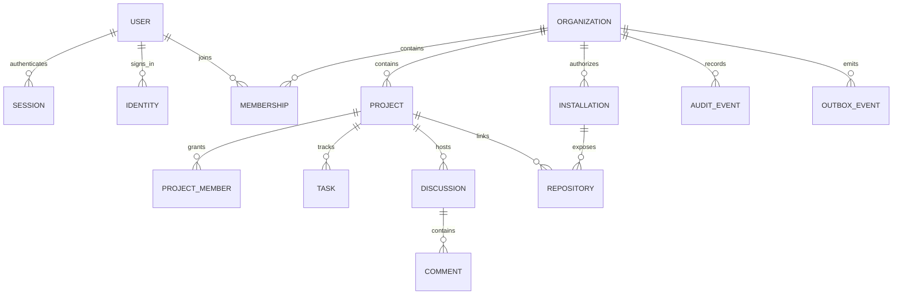

# Database and API boundaries

This contract describes the target implementation. The migration and generated OpenAPI document are authoritative for exact implemented field names. Deviations and deferred fields must be recorded in `progress.md`.

## Data model

IDs are UUIDs generated by the application; timestamps are UTC and timezone aware. Tenant data carries `org_id`; composite foreign keys prevent connecting children to another organization. User/membership rows are retained when membership is revoked so authorship remains valid. Foreign IDs are never authorization proofs.

| Entity | Key fields and invariants |
| --- | --- |
| User | UUID PK, display name, email, disabled flag, timestamps. Email is profile data; OIDC identity is issuer + subject, not email alone |
| Identity | Unique `(issuer, subject)`, FK user; never silently merge accounts by email |
| Session | Hash of random cookie PK, user FK, CSRF secret, created/last-seen/absolute-expiry/revocation; indexes by user and expiry |
| Login attempt | Hashed state, nonce, PKCE verifier, browser binding, expiry; consumed once |
| Organization | UUID PK, unique normalized slug, name, lifecycle/timestamps |
| Membership | PK `(org_id,user_id)`, role enum and active flag; owner preservation under organization lock |
| Project | UUID PK plus unique `(org_id,id)`, org FK, name/slug, visibility, archive flag, version; unique `(org_id,slug)` |
| Project member | `(org_id,project_id,user_id)` PK; composite project FK and membership FK; bounded role |
| Task | UUID PK, composite project FK, title/description, status, priority, creator/assignee, version, timestamps. Assignee must be active and eligible for that project |
| Discussion | UUID PK, composite project FK, title/body, creator, version, timestamps |
| Comment | UUID PK, discussion/project/org FKs, body, author, timestamps; discussion belongs to supplied project |
| Installation | GitHub installation numeric ID unique, org FK, external account, enabled/verified state; one installation belongs to one org |
| Repository | GitHub numeric repository ID, installation FK, org/project FK, full name/URL, last sync/status; unique mapping to a project |
| Webhook delivery | Unique delivery ID, event/action, installation reference, bounded payload, receipt/processing/retry state |
| Outbox event | UUID PK, org, kind, versioned payload, dedupe key, state, attempts, next retry, lease owner/expiry; immutable event data |
| Audit event | UUID PK, org, actor, action, resource ID, safe metadata, timestamp; append-only to runtime roles |

Tables used for identity lookups are global but accessed through narrow identity functions. Tenant queries set a transaction-local organization context after membership validation. Runtime roles cannot own tables, bypass RLS, or execute migrations. PostgreSQL policies include both read predicates and write checks. Project privacy remains an application policy; tenant RLS alone does not provide it.

Indexes follow actual access paths: membership by user/active state; projects `(org_id,created_at,id)`; tasks `(org_id,project_id,status,created_at,id)` and assignee; discussions/comments by project/thread and creation order; pending outbox `(state,next_retry_at)`; receipts by installation/time. No unbounded full-table Python filtering or Pandas.

Every content update increments `version`; stale writes return 409. Authorize and mutate inside one transaction. Lock the organization for last-owner changes. Creation, audit and outbox records commit atomically. Job processing is at-least-once: external effects and consumer updates must tolerate retries. Never claim exactly-once external delivery.

## HTTP contract

Browser requests use same-origin session cookies. Writes require `X-CSRF-Token`. JSON inputs use explicit schemas, reject unexpected fields, and cap strings and result sizes. Protected paths start with `/api/v1`; login routes start with `/auth`. Lists are bounded to at most 100 results and use stable ordering. An inaccessible resource returns 404; authenticated but forbidden visible actions return 403; unauthenticated requests return 401. Validation returns 422; conflicts 409; throttling 429 with Retry-After; dependency failures 503. Errors include a stable code/detail and request identifier without stack traces or secrets.

| Boundary | Routes | Policy |
| --- | --- | --- |
| Identity | `GET /auth/session`, `GET /auth/login`, `GET /auth/callback`, `POST /auth/logout` | Public login/session discovery; validated callback; CSRF-protected logout |
| Local evaluation | `POST /auth/dev-login` | Explicit development environment only; loopback/same-origin checks |
| Organizations | `GET/POST /api/v1/organizations`, `GET /api/v1/organizations/{org}` | Authenticated creation; membership for reads |
| Members | `GET/POST /api/v1/organizations/{org}/members`, `PATCH/DELETE .../members/{user}` | Owner/admin with role ceiling; owner-only privileged grants |
| Projects | `GET/POST /api/v1/organizations/{org}/projects`, `GET/PATCH .../projects/{project}` | Visibility-filtered reads; authorized creation/maintenance |
| Project grants | `GET/POST .../projects/{project}/members`, `DELETE .../members/{user}` | Maintainer or org owner/admin; active org membership required |
| Tasks | `GET/POST .../projects/{project}/tasks`, `PATCH/DELETE .../tasks/{task}` | Read project; contribute; deletion by author or maintainer |
| Discussions | `GET/POST .../projects/{project}/discussions`, `GET/PATCH/DELETE .../discussions/{discussion}` | Read project; contribute; author/maintainer edits |
| Comments | `GET/POST .../discussions/{discussion}/comments`, `DELETE .../comments/{comment}` | Read/contribute; author/maintainer delete |
| GitHub | `GET/POST /api/v1/organizations/{org}/github/installations`, project repository routes | Org owner/admin only; provider verification before linking |
| Webhooks | `POST /api/v1/webhooks/github` | Signature-authenticated raw bytes; no browser session requirement |
| Operations | `GET /health/live`, `GET /health/ready` | Minimal diagnostics; readiness checks DB/migration compatibility |

Full project prefixes are `/api/v1/organizations/{org}/projects/{project}`. Clients must not infer paths from slugs or allowlists. URLs accept UUIDs; names and slugs are presentation fields.

## GitHub consistency

The GitHub App requests only permissions needed for selected read-only metadata. A user-entered installation ID is not proof of authorization: verify it with the App credentials and a secure installation association flow. Check repository membership through that installation before storing a mapping. Delivery signatures cover original raw bytes and use constant-time comparison. Deduplicate by delivery ID before enqueueing. Return success only after durable receipt. Reconcile missed deliveries and treat deleted/revoked installations as disabled. External metadata stays administrator-only until a separate audience policy is approved. [GitHub webhook guidance](https://docs.github.com/en/webhooks/using-webhooks/best-practices-for-using-webhooks).

## AI extension

Migration `0002_ai` adds `ai_settings` keyed by `(org_id, project_id)` and `ai_requests` keyed by caller-generated UUID, with tenant/project and membership foreign keys and forced RLS. Requests store input hashes, operation kind, state, output and token usage; raw prompts are not persisted. All `/api/v1/organizations/{org_id}/projects/{project_id}/ai` endpoints recheck project access. `GET /settings` returns opt-in/provider availability, `PATCH /settings` requires organization administration, and `POST /generate` requires contributor access, explicit project consent and quota availability. A repeated request UUID with changed content is rejected; completed matching requests return the saved result. Provider errors are sanitized.
